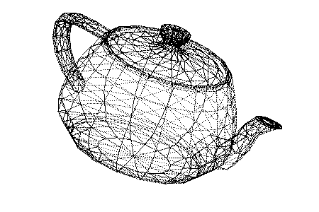

# Hologram
###### for [Rainmeter](https://www.rainmeter.net/)
Renders 3D models as point clouds.

## Features

* Scale, rotate, and apply perspective to model
* Optional auto-rotation
* Optional edge interpolation renders edges as points
* Automatically fits and centers model
* Uses no CPU while not being interacted with
* Supports .obj files
* Provides self-calibrating load time estimates

###### [Full description and download](http://killall-q.deviantart.com/art/Hologram-590866523)

---

## Explanation of 3D Rendering Algorithm

Hologram takes, for arbitrary points, 3D Cartesian coordinates (___x___, ___y___, ___z___) together with 3 angles of rotation (__pitch__, __roll__, __yaw__) and a perspective scalar, and translates them to screen space ___x___ and ___y___.

Let's build its algorithm from the ground up.

#### No Rotation or Perspective

Suppose you have an orthographic view of a set of points in 3D space such that the _y_-axis is parallel to your line of sight, with no rotation or perspective. In this situation, the _y_ coordinates of the points do not matter.

As such, the translation of those coordinates to screen space is very simple.

We establish here that our viewport, for ease of implementation, is a square with the origin of the 3D space at its center. The _x_-axis of the viewport faces right and the _y_-axis faces down, as they do on your screen. The _z_-axis of the 3D space we are viewing faces up, so _z_ coordinates must be flipped to compute screen space _y_ coordinates.

#### One Angle of Rotation: Pitch

Now we add pitch, which is rotation about the _x_-axis, or swivel up/down. This addition doesn't affect the _x_ coordinate.

As pitch angle, _θ_ (theta), increases from 0, the _z_ coordinate will have less and less of an effect and the _y_ coordinate will matter more and more. At 90°, or π/2 radians, the _z_ coordinate won't matter, and the _y_ coordinate has essentially replaced it.

There are mathematical tools that describe smooth oscillation between 1 and -1, through 0: [sine and cosine](https://en.wikipedia.org/wiki/Sine#Relation_to_the_unit_circle).

We know to multiply the _z_ coordinate by cosine of the pitch angle because at 0 degrees, it must be multiplied by 1. Similar logic follows for the _y_ coordinate.

#### Two Angles of Rotation: Pitch & Roll

Roll, _φ_ (phi), is rotation about _y_-axis, only, in this implementation, the _y_-axis of rotation itself is subject to the pitch angle. It works exactly like a [gimbal](https://en.wikipedia.org/wiki/Gimbal).

This is where visualizing how this works in your head starts to get a little difficult. Fortunately, we aren't removing from or rearranging the formula at all, only adding to it.

This may be easier to picture if you imagine that the 3D object you are rotating is a uniform disc on the _xz_-plane. The uniformity of the disc means that it doesn't matter what its roll angle is, it will still look the same. Pitch remains the only meaningful rotation.

Now if you mark a dot on this disc whose pitch rotation we have already explained, the position of that dot will vary on the plane of the disc based on the effect of the roll angle on the _x_ and _z_ coordinates of the dot. At 0 roll angle, the dot's _x_ coordinate is all that matters to screen space _x_, and the dot's _z_ coordinate is all that matters to screen space _y_... thus we know where to apply sine and cosine.

#### Three Angles of Rotation: Pitch, Roll, & Yaw

Yaw, _ψ_ (psi), is rotation about the _z_-axis. As you might guess, the _z_-axis of rotation is subject to the pitch _and_ roll angles.

With two angles of rotation, we had to replace all instances of _x_ and _z_ coordinates, the coordinates that are affected by rotations about the _y_-axis of rotation. Now, with yaw, we must replace all instances of _x_ (again) and _y_ coordinates, as they are affected by rotations about the _z_-axis of rotation. The _x_ coordinate is in both _x'_ and _y'_, and we replace it with the same thing in both places.

#### Perspective

This requires calculating screen space _z_-depth, but all the work has already been done. The formula for _z_-depth is almost identical to the final formula for screen space _y_. All that changes is sin and cos θ.

This formula makes sense once you understand that if you rotated the starting angle for θ by 90°, screen space _y_ would become _z_-depth. That is, in essence, what we are doing by changing cos θ to -sin θ and sin θ to cos θ, because sine and cosine are 90° offset from each other.

We then use it to obtain a value is greater than 1 if the point is closer to us than the origin, and less than 1 if it is farther, and use it to scale the final result.

This is not a true simulation of field of view (FOV). It merely approximates the effect by scaling up closer objects while shrinking far objects. __`perspective`__ is a scalar used to control the strength of the FOV approximation. At 0, the effect is negated.

#### Closing

This isn't the only possible correct formula for 3D rotation. It is only correct for this set up, where the roll axis is specifically dependent on pitch, and the yaw axis is specifically dependent on both pitch and roll. For example, a different formula would be required for fixed axes of rotation. The formula would also change slightly depending on where you consider the zeroes of the rotation angles to be.

This work is licensed under a [Creative Commons Attribution-NonCommercial-ShareAlike 3.0 License](http://creativecommons.org/licenses/by-nc-sa/3.0/).
